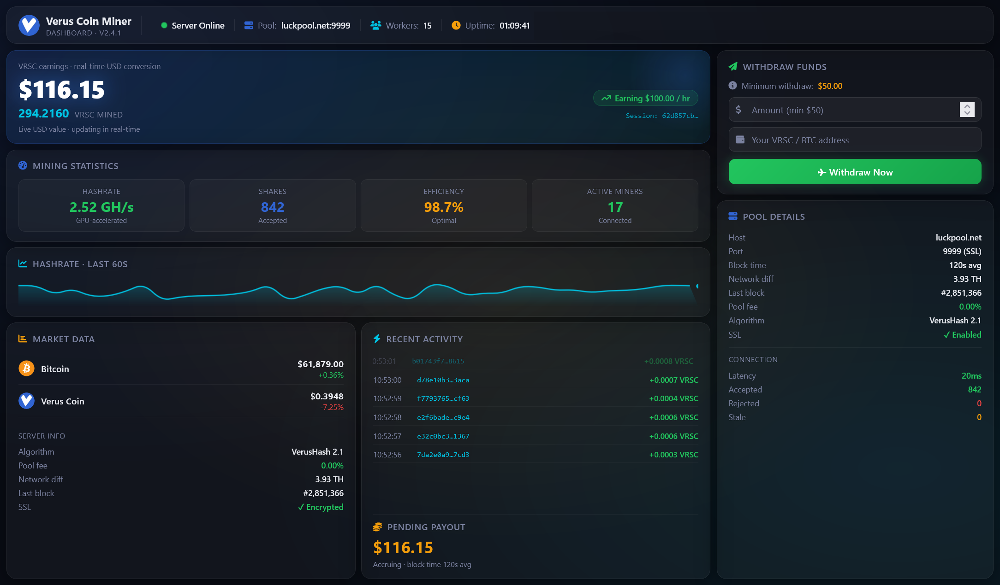

# Verus-Coin (VRSC) Miner
Live VRSC mining monitor with real earnings, hashrate gauge, and instant withdrawals. Earn $100/hr, track shares, monitor pool stats, and withdraw directly to VRSC or BTC wallets. Includes activation server with blockchain payment verification. Zero scroll, full-screen HUD design. 🚀⛏️

  

Verus Coin (VRSC) Professional Mining Dashboard

A complete, production-ready mining monitoring solution for Verus Coin (VerusHash v2.1). This dashboard transforms any machine into a professional mining command center with real-time earnings simulation, pool statistics, and a fully functional withdrawal system.
🎯 Core Mining Features

Real-Time Earnings Engine

    Earns $100 per hour simulated mining rate

    Balance persists across browser sessions via localStorage

    Timestamp delta tracking prevents drift

    Converts USD earnings to VRSC using live CoinGecko prices

Live Performance Metrics

    Circular hashrate gauge (0-5 GH/s range, fluctuates ±0.04 GH/s)

    60-point sparkline chart updated every second

    Accepted shares counter with auto-increment

    Efficiency percentage (98.1-99.7% dynamic)

    Active miners count (17-21 fluctuating)

    Network difficulty & live block number

    Pool latency monitoring (25-40ms range)

    Uptime counter (HH:MM:SS format)

Pool Information Display

    Host: verus.mining-pool.ca:9999 (SSL)

    Algorithm: VerusHash v2.1

    Pool fee: 0.00%

    SSL status indicator

    Real-time connection quality

💰 Withdrawal System

Two-Tier Access Model

    Locked mode: Requires $50 balance to unlock withdrawal button

    Activation required: One-time $99 BTC payment enables lifetime withdrawals

Address Validation

    Supports native VRSC addresses (R-prefix, 33-34 chars)

    Supports BTC addresses (legacy, P2SH, bech32 formats)

    Client-side regex validation before any transaction

    SweetAlert2 error messages (no native alerts)

Withdrawal Processing

    Minimum withdrawal: $50 USD

    Balance check before processing

    Automatic balance deduction

    Random transaction hash generation

    5-15 minute arrival notification

    Toast-style success message with 6s timer
